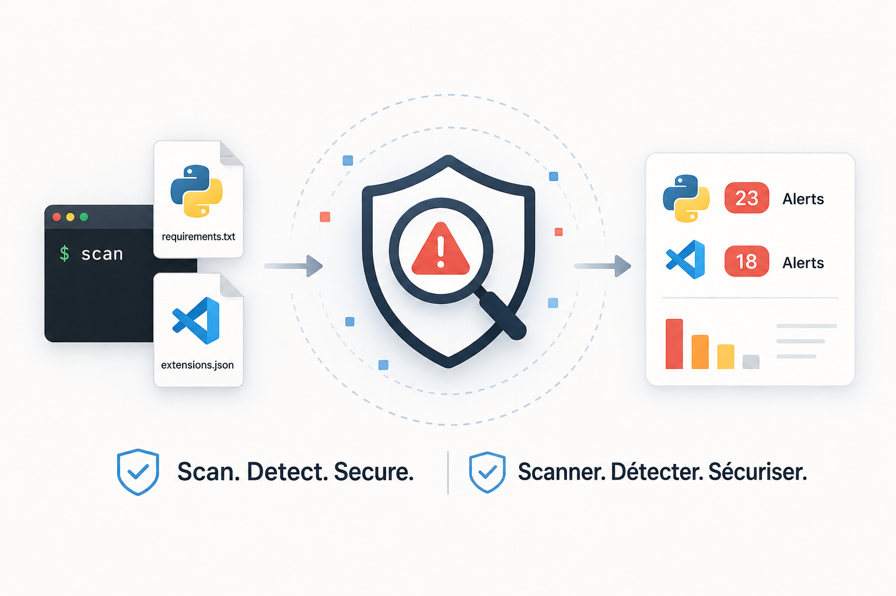

<p align="center">
  
</p>

> 🇬🇧 English | [🇫🇷 Français](./README_FR.md)


[](https://www.youtube.com/@Palks_Studio)
[](https://www.linkedin.com/in/palks-studio/)

<p align="center">
  <a href="https://palks-studio.com">
    
  </a>
</p>

# Dependency Security Checker, Open Source

A local and open source tool designed to quickly identify Python dependencies and VS Code extensions known to be deprecated, archived, renamed, inactive, or unmaintained.

The project works with local alert databases and does not require any external service.

---

## Project structure

```text
dependency-security-checker/
│
├── checker.py                     → Python package alert checker
├── extension.py                   → VS Code extension alert checker
├── alerts.json                    → Python package alert database
├── extensions.json                → VS Code extension alert database
├── LICENSE.md                     → MIT License
├── README.md                      → English documentation
├── README_FR.md                   → French documentation
│
└── docs/
    ├── images/
    │   ├── checker.png            → Project preview
    │   └── Palks_Studio.png       → Palks Studio logo
    └── videos/
        └── checker.mp4            → Checker demos
```

---

## Why this tool?

Over time, a development environment can accumulate many Python packages and VS Code extensions.

Some projects eventually become abandoned, archived, renamed, or officially deprecated without the user necessarily noticing.

Dependency Security Checker provides a quick way to inspect the installed environment and flag known entries found in its alert databases.

The goal is not to make decisions for the user, but to provide information that can then be reviewed and investigated.

---

## Features

The project currently contains two independent tools.

### Python packages

`checker.py` scans packages installed in the active Python environment and compares them against the local `alerts.json` database.

For each known match, the report can display:

- the detected package  
- its installed version  
- its status  
- the reason for the alert  
- a suggested replacement when available  
- the source used to document the alert

### VS Code extensions

`extension.py` scans extensions installed in VS Code and compares them against the local `extensions.json` database.

The script also retrieves the installed version of each extension.

When a known extension is detected, the report displays its status, the reason for the alert, a possible alternative, and the corresponding source.

---

## Statuses

The databases can currently flag several situations:

- `deprecated`: deprecated project  
- `unmaintained`: unmaintained project  
- `archived`: archived project  
- `renamed`: renamed or moved project  
- `inactive`: inactive project

An alert does not necessarily mean that a package or extension has a security vulnerability.

It means that an installed component matches a known entry in the project's database and may deserve further review.

---

## Usage

Clone or download the project, then open a terminal in the project directory.

### Check Python packages

```bash
python checker.py
```

The script scans the Python environment from which it is executed.

To inspect a specific virtual environment, activate that environment first and then run the script.

Example:

```bash
python checker.py
```

If no known match is found:

```text
[OK] No known alert found.
     Aucune alerte connue détectée.
```

If a package listed in the database is detected, an alert similar to this one is displayed:

```text
[!] package-name 1.0.0
    Status / Statut: DEPRECATED / DÉPRÉCIÉ

    Reason:
    ...

    Raison :
    ...

    Suggested replacement / Remplacement suggéré: ...

    Source: ...
```

### Check VS Code extensions

```bash
python extension.py
```

VS Code must be installed and the `code` command must be available from the terminal.

The script retrieves installed extensions and their versions, then compares them against `extensions.json`.

If no known match is detected:

```text
[OK] No known alert found.
     Aucune alerte connue détectée.
```

---

## Alert databases

The project uses two local files:

```text
alerts.json
extensions.json
```

`alerts.json` contains alerts for Python packages.

`extensions.json` contains alerts for VS Code extensions.

Each entry can include a status, an explanation in French and English, an optional replacement, and a source that can be used to verify the information.

The databases are expected to evolve as new deprecations, migrations, archives, and abandoned projects are identified.

---

## Local operation

Dependency Security Checker runs locally.

The scripts do not send your package or extension list to an external server, and no remote API is required to perform the scan.

All comparisons are performed against the JSON files included in the project.

---

## No automatic changes

The tool is read-only.

It does not:

- uninstall packages  
- remove extensions  
- disable extensions  
- update dependencies  
- install replacements  
- modify your projects

It only displays alerts matching the local databases.

The decision to keep, replace, update, or remove an item remains entirely up to the user.

---

## Requirements

For Python package scanning:

```text
Python 3
```

No external Python dependency is required.

For VS Code extension scanning:

```text
Python 3
Visual Studio Code
"code" command available in PATH
```

---

## Limitations

The alert databases are not intended to be exhaustive.

The absence of an alert does not mean that a package or extension is maintained, secure, or free from vulnerabilities.

Likewise, the presence of an alert does not necessarily mean that the component is dangerous.

The tool provides a first level of information intended to draw attention to dependencies known to be deprecated, archived, renamed, inactive, or unmaintained.

The sources included with the alerts can be used for further verification.

---

## Contributing

Contributions are welcome, particularly to:

- report a deprecated or abandoned dependency  
- report a deprecated or abandoned VS Code extension  
- correct existing information  
- add or improve a source  
- suggest improvements to the checker

Any new alert should ideally include a public source that can be used to verify its status.

---

## License

This project is distributed under the MIT License.

© Palks Studio — see LICENSE.md  
- https://palks-studio.com